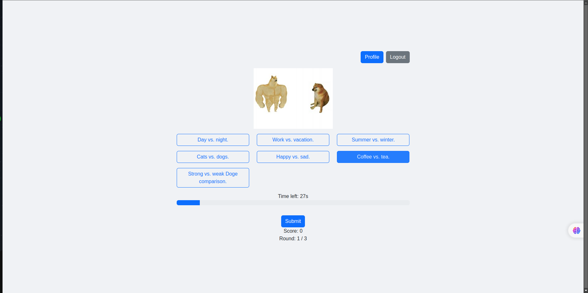
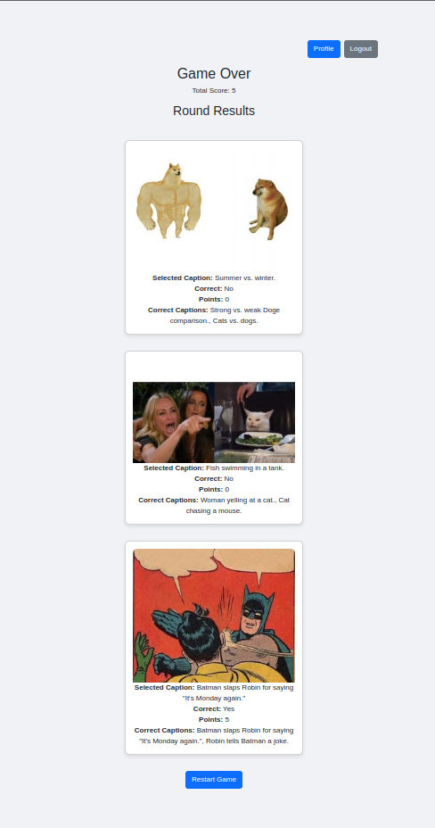

# Exam #1: "Web Application"
## Student: s330244 Rehman Rana Nooris Ur 

## React Client Application Routes

- Route `/`: 
  - **Login Page**: Allows users to log in with their credentials. If the user is not registered, they can navigate to the registration page. There's also an option to play as a guest.
- Route `/register`: 
  - **Register Page**: Allows new users to register by providing a username and password.
- Route `/game`: 
  - **Game Page**: The main game interface where users can play the meme caption game. Users select captions for memes, and their scores are updated based on correctness.
- Route `/profile`: 
  - **Profile Page**: Displays the logged-in user's game history, including details of each game and round played.

## Main React Components

- `Login` (in `Login.jsx`): 
  - **Purpose**: Handles user login functionality.
  - **Main Functionality**: Takes user input for username and password, authenticates the user, and navigates to the game page upon successful login.
- `Register` (in `Register.jsx`): 
  - **Purpose**: Handles user registration.
  - **Main Functionality**: Takes user input for username and password, registers the user, and navigates to the login page upon successful registration.
- `Game` (in `Game.jsx`): 
  - **Purpose**: Manages the game logic.
  - **Main Functionality**: Fetches memes and captions, handles user caption selection, updates the score, and manages the game rounds.
- `Profile` (in `Profile.jsx`): 
  - **Purpose**: Displays user game history.
  - **Main Functionality**: Fetches and displays the user's past games and rounds with scores and selected captions.

## API Server

- POST `/login`: 
  - **Purpose**: Authenticates a user.
  - **Request Body**: `{ "username": "user", "password": "pass" }`
  - **Response Body**: `Logged in` on success.
  - **Response Status Codes**: `200 OK` on success, `401 Unauthorized` on failure.
- GET `/logout`: 
  - **Purpose**: Logs out the authenticated user.
  - **Response Body**: `Logged out`
  - **Response Status Codes**: `200 OK` on success, `500 Internal Server Error` on failure.
- POST `/register`: 
  - **Purpose**: Registers a new user.
  - **Request Body**: `{ "username": "user", "password": "pass" }`
  - **Response Body**: `User registered`
  - **Response Status Codes**: `201 Created` on success, `500 Internal Server Error` on failure.
- GET `/api/meme`: 
  - **Purpose**: Fetches a random meme with captions.
  - **Response Body**: `{ meme: {...}, captions: [...] }`
  - **Response Status Codes**: `200 OK` on success, `500 Internal Server Error` on failure.
- POST `/api/submit`: 
  - **Purpose**: Submits a selected caption for a meme.
  - **Request Body**: `{ "meme_id": 1, "caption_id": 1 }`
  - **Response Body**: `{ "isCorrect": true, "correctCaptions": [...] }`
  - **Response Status Codes**: `200 OK` on success, `500 Internal Server Error` on failure.
- POST `/api/save-game`: 
  - **Purpose**: Saves the game results.
  - **Request Body**: `{ "results": [...], "score": 10 }`
  - **Response Body**: `Game saved`
  - **Response Status Codes**: `201 Created` on success, `500 Internal Server Error` on failure.
- GET `/api/games`: 
  - **Purpose**: Fetches the user's game history.
  - **Response Body**: `[ { game }, ... ]`
  - **Response Status Codes**: `200 OK` on success, `500 Internal Server Error` on failure.

## Database Tables

- Table `users`: 
  - **Contents**: Stores user information (id, username, password).
- Table `memes`: 
  - **Contents**: Stores meme information (id, image_url).
- Table `captions`: 
  - **Contents**: Stores captions for memes (id, text).
- Table `meme_captions`: 
  - **Contents**: Links memes to captions and indicates if they are the best match (meme_id, caption_id, best_match).
- Table `games`: 
  - **Contents**: Stores game information for users (id, user_id, user_game_id, score, timestamp).
- Table `rounds`: 
  - **Contents**: Stores each round's details in a game (id, game_id, meme_id, selected_caption_id, is_correct).
- Table `correct_captions`:
  - **Contents**: Links correct captions to rounds (round_id, caption_id).

## Screenshots

## Users Credentials

- Username: `user1`, Password: `password1`
- Username: `user2`, Password: `password2`
